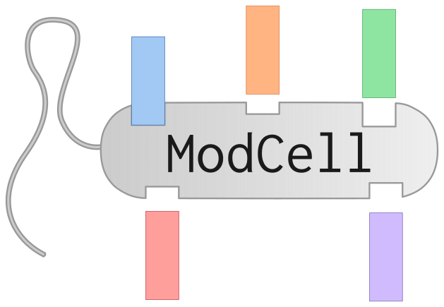

This is the repository for the ModCell2 modular strain design framework.

If you use any part of this software, please cite:

::

        Sergio Garcia and Cong T. Trinh,
        Multiobjective strain design: A framework for modular cell engineering,
        Metabolic Engineering, Volume 51, 2019, Pages 110-120, ISSN 1096-7176,
        https://doi.org/10.1016/j.ymben.2018.09.003.

You may also find the following publications relevant:

::

        Sergio Garcia and Cong T. Trinh,
        Comparison of Multi-Objective Evolutionary Algorithms to Solve the Modular Cell Design Problem for Novel Biocatalysis,
        Processes 7, (2019).
        https://doi.org/10.3390/pr7060361

::

        Sergio Garcia and Cong T. Trinh,
        Modular design: Implementing proven engineering principles in biotechnology,
        Biotechnology Advances, 2019,
        https://doi.org/10.1016/j.biotechadv.2019.06.002.

::

        Sergio Garcia and Cong T. Trinh,
        Harnessing natural modularity of cellular metabolism to design a modular chassis cell for a diverse class of products by using goal attainment optimization,
        (In preparation)

Download_ these references in BibTeX format.

.. _Download: https://raw.githubusercontent.com/TrinhLab/ModCell2/master/garcia.bib

Installation
------------
Download or clone this repository, then add simply add the ModCell2 folder to your MATLAB path by running
::

   addpath(genpath(['<parent-directory>', filesep, 'ModCell2']))

Where <parent-directory> depends on your system. To verify your installation execute :code:`run_all_tests.m`. :warning: Make sure the Requierements_ are met. :warning:.

Quick start
------------

All you need to use ModCell2 is a cobra model for your host organism, and the heterologus reactions required for each production pathway.
Examples and more details are provided in the Documentation_.

.. _Documentation: https://modcell2.readthedocs.io

Questions and help
------------------

Open an issue_ if you encounter an error or need assitance.

.. _issue: https://github.com/TrinhLab/modcell2/issues/new

Contributions
-------------

If you improve ModCell, please share your contribution creating a pull request. Remember to use google-style or numpy-style docstrings, and create a test for your code.

Requierements
-------------

- Matlab (>=2016a) together with the Global Optimization Toolbox and Parallel Computing Toolbox.

- The Cobratoolbox_ must be properly installed.

- Optimization solver:
    - GLPK: This is the best option for solving LPs. It should be working once you installed Cobratoolbox_.
    - linprog_ (optional): This solver is included in the Matlab Optimization Toolbox and suported by ModCell but not recomended.
    - Gurobi_ (optional): Free licensces are available for academia. This may only be required for analysis methods solving quadratic programming (QP) problems.
    - Other (optional): Solvers can be easily added by modifying the method *calc_basic_objectives.m*

.. _Cobratoolbox: https://github.com/opencobra/cobratoolbox
.. _linprog: https://www.mathworks.com/help/optim/ug/linprog.html
.. _Gurobi: http://www.gurobi.com/index

